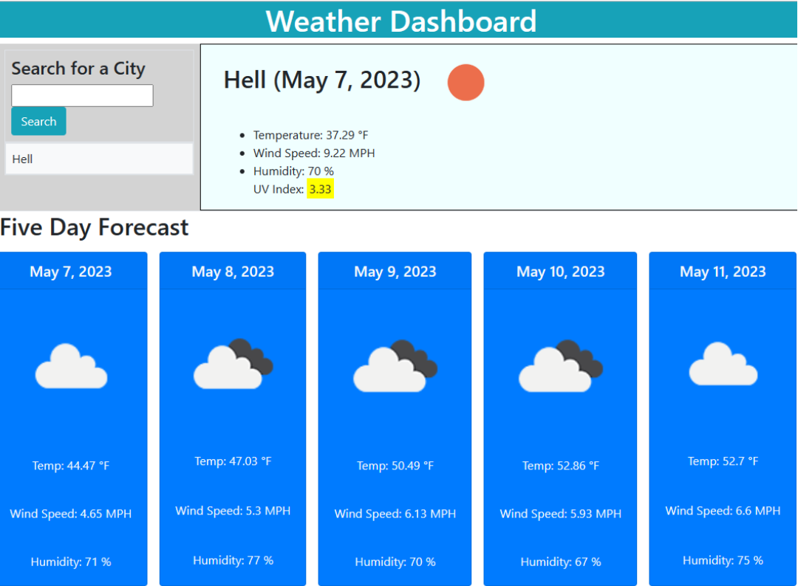

# 5 Day Weather Forcast Dashboard

## Description
A simple API that uses [Open Weather API](https://openweathermap.org/forecast5) to tell the weather forecast for the current time and the next five days. 
This API used Bootstrap, jQuery, and Day.js to format and make the page function.

## Built With
* [HTML](https://www.w3schools.com/html/)
* [CSS](https://developer.mozilla.org/en-US/docs/Web/CSS)
* [JavaScript](https://developer.mozilla.org/en-US/docs/Web/JavaScript)
* [Open Weather API](https://openweathermap.org/forecast5)
* [Bootstrap](https://getbootstrap.com/docs/5.3/getting-started/introduction/)
* [Day.js](https://day.js.org/)

## Usage
Enter in a city's name and the current weather conditions as well as the next 5 day weather forecast will appear before you on the screen.

## Website Link
[Website Link](https://roamingheart.github.io/weather-dashboard/)

## Website Preview

## Criteria for Acceptence
* GIVEN a weather dashboard with form inputs
* WHEN I search for a city
* THEN I am presented with current and future conditions for that city and that city is added to the search history
* WHEN I view current weather conditions for that city
* THEN I am presented with the city name, the date, an icon representation of weather conditions, the temperature, the humidity, and the wind speed
* WHEN I view future weather conditions for that city
* THEN I am presented with a 5-day forecast that displays the date, an icon representation of weather conditions, the temperature, the wind speed, and the humidity
* WHEN I click on a city in the search history
* THEN I am again presented with current and future conditions for that city

## Credits
I was able to make this application through viewing several people's repositories on GitHub. A few notable people that I took inspiration from are [Jeckline Jebet](https://github.com/Jackline-Jebet), [mlportu](https://github.com/mlportu), and [Mei Tu](https://github.com/mmeii).

## Liscense
 [Open Source Initiative Link](https://opensource.org/licenses/MIT)

